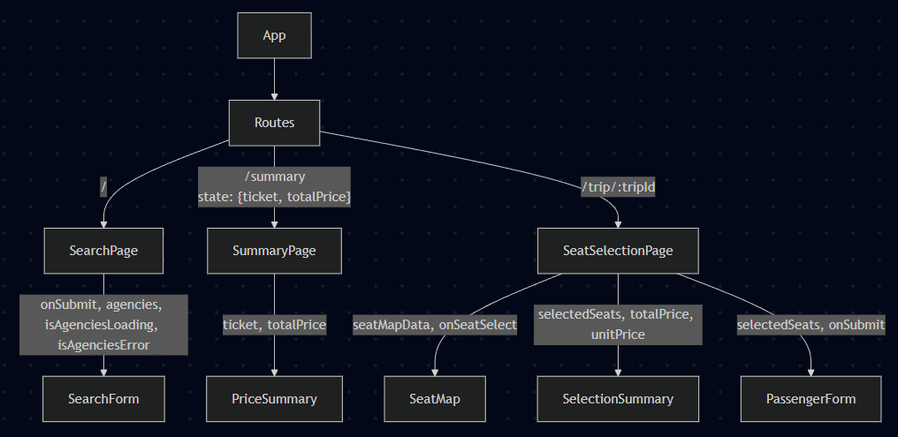

# Busx
Busx is a highly robust and extremely fast frontend for a ticket buying application.
- With over 98 points average on Google Lighthouse 
- 0 Unnecessary Re-Renders, Meaningful memoizations, Lazy loading.
- Strongly typed using Typescript


# Kurulum & Çalıştırma
- Install the necessary packages using `npm install`
- run the project using `npm run dev`
- (optional): run tests by using `npm test`

###  Tüm akışı karşılayabilecek arama: İstanbul - Alibeyköy -> Ankara - AŞTİ  (28.11.2025) 
(validation için bugünden önceki tarihi seçemiyoruz, eğer 28.11.2025'i geçtiysek lütfen mockData'daki bilet değerlerini bugünden sonraki tarih ile değiştirin)
# Teknik tercihler
Added antfu Eslint config for one liner eslint configuration. https://github.com/antfu/eslint-config
```json
{ 
  "@antfu/eslint-config": "^6.2.0",
  "eslint-plugin-format": "^1.0.2",
  "@eslint-react/eslint-plugin": "^2.2.4"
}
```

# Notlar
- Sitenin sol üstünde Dark mode ve Dil değişim butonu(canlı) bulunuyor. (I18Next for live language switching)
- Biletin PDF çıktısı sorunsuz alınıyor. (Custom CSS for Printing)


# Mimari şema



